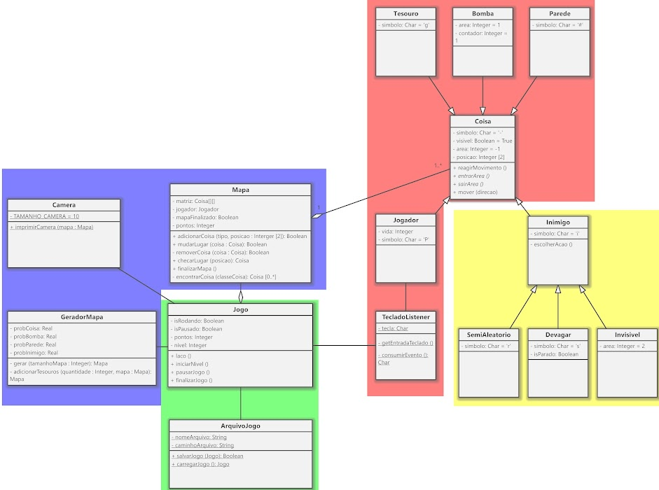

# if992-Prova-AV2_Pequeno-Jogo
Refazendo a prova AV2 de Programação 2

Obs:
O diagrama e a descrição são apenas uma visão geral do sistema. Conforme encontrem aplicação, grupos devem implementar padrões de projeto que se encaixem com as classes trabalhadas.

### 1. Coisa

Toda **Coisa** possui acesso ao **Mapa**.
Os métodos de Coisa deverão ser sobrescritos pelas subclasses que necessitarem. O comportamento padrão dos métodos concretos é não fazer nada.

#### 1.1 Inimigo

O método escolherAcao() escolher uma direção aleatória para mover().

##### 1.1.1. Semialeatorio

Semialeatório se move aleatoriamente 50% das vezes e se move em uma direção se aproximando do Jogador nas demais.

##### 1.1.2 Devagar

Devagar se fica parado um movimento e se move em uma direção se aproximando do Jogador em outro movimento.

##### 1.1.3 Invisivel

Invisível sobrescreve os métodos entrarArea() e sairArea(), nesses o símbolo do objeto é alterado para o mesmo do valor padrão de Coisa (espaços vazios) ao sair e para 'o' ao entrar.

#### 1.2 Jogador

Jogador move em uma das quatro direções de acordo com o evento consumido que é passado para mover()

#### 1.3 Tesouro

reagirMovimento() verifica se existe algum outro **Tesouro** no mapa e caso não exista finaliza o mapa com sucesso, além disso, remove o tesouro do mapa.

#### 1.4 Bomba

Bomba reage ao movimento diminuindo seu contador até 0. Em 0, o contador é resetado e a bomba verifica se existem **Coisas** em uma cruz com distância 2 (2 para cima, 2 para a esquerda, etc.) e chama reagirMovimento() de cada **Coisa** encontrada.

Bomba sobrescreve os métodos entrarArea e sairArea, nesses o símbolo do objeto é alterado para o mesmo do valor padrão de Coisa (espaços vazios) ao sair e para ‘*’ ao entrar.

#### 1.5 Parede

Parede impede o movimento.

### 2. TecladoListener

getEntradaTeclado() recebe um caractere de entrada do usuário e guarda como ‘tecla’. ‘tecla’ é limpa e retornada ao chamar consumirEvento().

